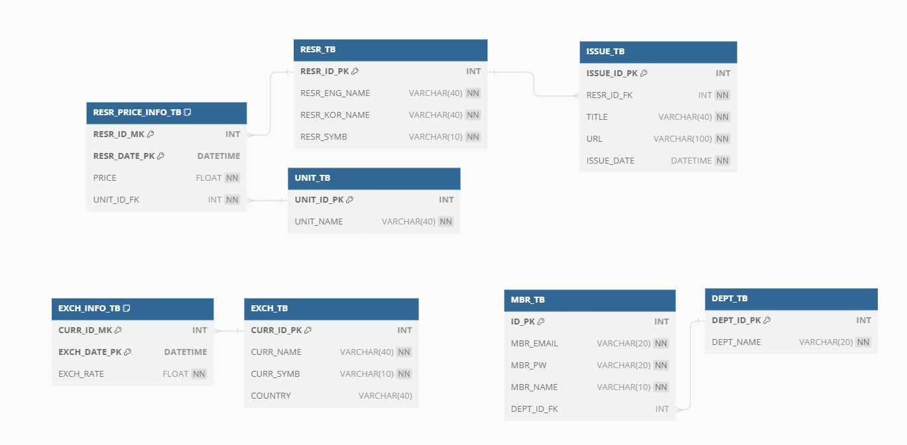

<h1 align="center">데이터 수집과 예측 프로젝트 백엔드 💻 </h1>

## 🛠️ 기술 스택

 


 
<!--   -->


## 🤹🏻 기술 스택 선정 이유

- SpringBoot : SpringBoot 라이브러리를 사용행 여러개발자와 개발간에 일정한 규칙을 통해 개발의 통일성을 가지고 계발할 수 있기 때문에 사용했습니다
- Springsecurity : 이미 만들어진 security 사용하여 보안의 편의성과 안정성을 갖추기 위해 사용했습니다
- Java Persisitence API : Java 코드로 DB를 제어 하기위해서 사용했습니다
- Junit : 만들어진 Controller를 테스트 하기서 사용하였습니다
- JsonWebTokens : 서버의 부담 클라이언트에게 부여하도록 하기 위해 사용했습니다
<!-- - gradle : 빌드 속도의 향상과 설정 파일의 가독성 상승, -->
- mysql : 상용화 되어있는 Oracle을 대신하여 학습용으로 할 수 있는 DB 이기에 사용했습니다

## 📌 프로젝트 목표

```sh
1. 수집한 데이터를 DB에 저장을 한다

2. 날짜 기준으로 필요한 만큼의 데이터를 조회한다

3. JWT 방식으로 로그인을 한다
```

## 📄 ERD

<center>
    
</center>

## 🔍 Overview

### 1. 데이터 저장

\*저장

- Java code로 SQL문을 실행 할 수있도록 JPA를 사용하여 DB에 저장한다

<br>

### 2. 데이터 조회

JPA를 사용하여 DB에서 조회한다<br>
입력 받은 Date를 기준으로 오늘 날까지의 모든 데이터를 불러오도록 <br>Between연산을 실행한다

<br>

### 3. 로그인 회원가입

JWT을 사용하여 서버에 부담을 줄이는 인증 방식을 사용한다

<br>

<!-- ### 4. 멤버쉽

<center>
    
</center>
권한 수준을 확인하여 AI 데이터를 볼 수 있도록 한다

<br> -->
